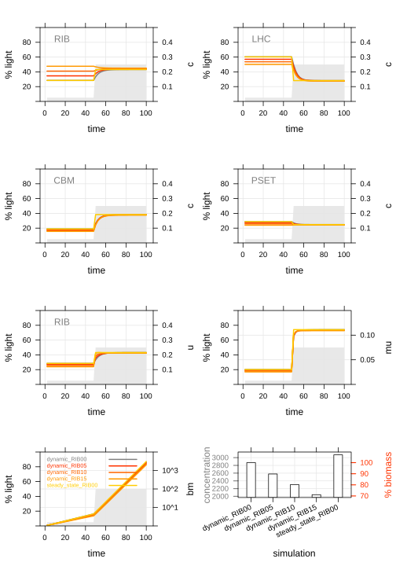

# cell-economy-models


Cellular economy models for simulation of biological optimization problems

## Related publications

- **Jahn et al., 2018, Cell Reports**  https://www.cell.com/cell-reports/fulltext/S2211-1247(18)31485-2
- R. Burnap, 2015, Frontiers Bioeng Biotech  http://journal.frontiersin.org/article/10.3389/fbioe.2015.00001/abstract
- Molenaar et al., 2009, Mol Systems Biology  http://www.pubmedcentral.nih.gov/articlerender.fcgi?artid=2795476&tool=pmcentrez&rendertype=abstract

## Getting started

The structure and programmatic details of the model are outlined below. However, if you just want to get started and play around with the model, you need a working python installation and install the [GEKKO optimization framework](https://gekko.readthedocs.io/en/latest/).

In a linux terminal, run:

```bash
sudo apt install python-pip
pip install gekko
```

The different models of this repository can be found in the `models/` dir. Currently available models are:

- *Synechocystis* sp. PCC6803
  - steady state resource allocation model (7 components)
  - dynamic, time-dependent variant of the resource allocation model

To run a simulation, open `run_model.py` and execute the desired sections to import and start the model.
A basic example looks like this:

```python
# libraries
import numpy as np
from models import synechocystis_steadystate

# parameters
light = np.round((np.sin(np.arange(0, 4*3.1415, 4*3.1415/96))+1)*50)+1
time = np.arange(0, len(light)/2, 0.5)
sub = 100                                       # initial substrate concentration, CO2/HCO3-
c_upper = [1,1,1,1,1,1,90,25,25,5,1,1,1]        # optional list of concentration upper bounds
reserve = [0.0, 0.0, 0.0, 0.0, 0.0]             # fraction of enzyme reserve in total
mumax = 0.11                                    # maximum growth rate, used to calculate protein utilization
Ki = 5000                                       # light inhibition constant for photosystems

# start model
result = synechocystis_steadystate.simulate(time, light, sub, c_upper, reserve, mumax, Ki)
```

The results can be exported as `*.csv` table and can be visualized e.g. with R or python. This plot shows how a step change in light intensity (grey area) affects size/expression of different proteome sectors over time (RIB, ribosome, LHC, light harvesting complex, CBM, carbon metabolism, PSET, photosynthesis and electron transport). You can see different dynamic simulations and the steady state optimal protein allocation (yellow line).



## Basic assumptions

The cellular economy models deposited here are 'coarse-grained' metabolic models for the simulation of fundamental cell processes. The purpose of these models is not to reflect cellular behavior in its entire complexity, but rather to reduce complexity to an amount that still allows drawing significant conclusions while keeping the number of components and reactions as small as possible. Following this assumption, a cellular economy model may not contain all known metabolic pathways, enzymes or known kinetic parameters thereof. It rather bundles fundamental cellular processes in 'super-enzymes', single catalytic units that serve as proxies for several similar or related pathways. However, the output from a coarse-grain model is still very useful as it illustrates metabolic tradeoffs under different conditions, without getting lost in details. The models are generally mixed-integer non-linear optimization (MINLP) problems. The models are formulated to optimize growth of a cell, but different aspects of cellular behaviour can be probed as well.

## Previous models

These models are based on previous work by Molenaar et al. (2009) and Burnap (2015). Molenaar and co-authors initially established equations for simple optimization models and implemented it programmatically in GAMS. The original model simulates a simple heterotrophic cell with only four components ('super-enzymes'): A substrate transporter, a metabolic enzyme turning substrate into precursors, a lipid biosynthesis enzyme consuming precursors and producing lipids, and a ribosome consuming precursors and synthesizing all proteins including itself. The model, its features and behavior under different nutrient conditions are excellently described in the original publication. A similar implementation by R. Burnap (2015) extended the model towards the simulation of a photoautotrophic cell. Instead of a single carbon and energy source, it contained one substrate as the carbon source (e.g. CO2) and another, light, as the energy source.

## The *Synechocystis* model

### Changes to preceding models

This implementation of a autotrophic cell model is a direct continuation of the previous two models, particularly the one from Burnap (2015). However, it was modified and extended to make it fit for experimental proteomics data and reflect more realistic properties of a cyanobacterial cell. Programmatically, the model was ported from the commercial `GAMS` language to open source `python` using the GEKKO optimization toolbox. The model comes in two flavors, a steady state optimization of all cell compounds, or a dynamic simulation to follow time- and input parameter-dependent changes.

-----

The following changes were made to the components of the model: Cyclic reactions of ATP/NADPH were removed and implemented as regular metabolites. The STA enzyme was removed and carbon import was included in the CBM enzyme. The membrane was divided into thylakoid (thy) and cytoplasmic membrane (cpm). Thylakoid membrane contains LHC and PSET, the photosynthetic machinery, while cytoplasmic membrane can contain e.g. transporters. Membrane integrity conditions state that membrane protein concentration cannot exceed membrane lipid concentration. An optional minimal concentration of membrane lipids can be set to avoid infinitely small membranes. The cell surface area was entirely based on the cytoplasmic membrane. The thylakoid membrane and its proteins were eliminated from the equation to prevent infinity low β (volume to surface ratio). Very low β values would mean a highly convoluted cell shape. Thylakoid proteins (thyP) are now part of the intracellular protein balance which is more realistic, i.e. they take up intracellular space. Optional constraints from experimental proteomics were included in form of a linear equation for each protein. Simulation of photosystem inhibition by DCMU was implemented as reduction of kcat PSET by a certain factor. DCMU is an inhibitor of PSII, the first of the two photosystem complexes, that drives electron transfer to plastoquinone (PQ) and oxidation of water. DCMU inhibits the reduction of PQ at PSII, preventing the primary step of photosynthesis. However, cyclic electron flow via PSI may continue in real cells. Photoinhibition is simulated by including an inhibition term in the rate equation for the light harvesting sector LHC.

### Implementation

The model consists of six coarse-grained enzymes and five metabolites. Briefly, light is captured by a light harvesting complex, LHC, and used to generate atp and nadph by a photosynthetic electron transport chain, PSET. CO2 is imported and assimilated by the carbon metabolism enzyme CBM using atp and nadph. The resulting precursors pre are consumed by lipid biosynthesis (LPB) and ribosome (RIB) enzymes. The ribosome has a special role as it synthesizes all proteins including itself and a group of maintenance proteins (MAI) that are non-catalytic. In steady-state mode, the supply of nutrients is constant over time and no degradation of cellular compounds takes place. Therefore, the cellular composition does not change over time and an optimal solution for a set of boundary conditions exists that has maximum growth rate μ. Growth rate μ is the factor by which all cellular components increase per unit time t (although time is not explicitly included in steady state).

The model is defined by sets of components that are organized in subsets. An example is that the subset 'enzymes' contains all proteins that have a catalytic function. The properties of components are defined by parameters. The relation of components to each other is defined by equations. The model features variables that are in principle similar to parameters, but are not fixed and are optimized in the solving process (within specified boundaries).

### System of equations

The fundamental equations are similar to the models published by Molenaar et al. (2009) and R. Burnap (2015). A detailed description of model components and equations can be found in our publication:

*Jahn et al., 2018, Cell Reports*  https://www.cell.com/cell-reports/fulltext/S2211-1247(18)31485-2

- The cell volume is, unlike in the previous models, not defined by the sum of all membrane component's area but only based on cytoplasmic membrane components. The volume is fixed to 1, but cell surface area is variable, yielding a variable volume to surface ratio β. Surface area is the sum of cytoplasmic membrane area Acpm and specific area sA times concentration c of each membrane protein cpmP. Lower β means a higher convoluted cell shape, higher β a more round shape.

- The total protein concentration inside the cell is the sum of all individual protein concentrations and
is, just as the cell volume, fixed to 1.

- The fraction of ribosomes engaged in synthesis of a respective protein is called α, and the sum of all α i for each protein i is 1. Note that α is also the relative abundance of a particular protein in steady-state (the proteome mass fraction), so that sum(αi) = sum(ci) = 1. In dynamic mode, α can differ from c, meaning that the fraction of ribosomes synthesizing a protein can be different from its momentary concentration.

- Two mass balances for protein and metabolites contain terms for production and consumption of cellular components in steady state. The production of proteins depends solely on the rate of the ribosome v RIB . The production of metabolites depends on the rate of the involved enzymes v times the stoichiometry matrix sm. The consumption is the amount of proteins or metabolites dedicated for cell growth, expressed through the specific growth rate μ times the steady-state concentration ci of the component i.

- The original equation for the catalytic rate of enzymes followed Michaelis-Menthen-like notation. It was extended by a Hill coefficient that accounts for cooperativity. 

- The rate equation for the light harvesting complex LHC additionally contains a term for photoinhibition with an inhibition constant Ki to account for the fact that excess light becomes damaging to the cell and reduces growth rate. 

- Two membrane systems have been implemented for the photosynthetic cell. The cytoplasmic membrane cpm defines the shape of the cell and houses transporters. The intracellular thylakoid
membrane thy houses the photosynthesis related proteins. The sum of the concentration of these two components equals the total lipid concentration. 

- A membrane integrity constraint for both membrane systems states that the concentration of proteins within the membrane c memP should not exceed the concentration of membrane lipids c lip . An optional parameter c min determines the minimum lipid concentration in order to avoid an infinitely small membrane in case very few membrane proteins are expressed.

### Parameters and constraints

Some fundamental constraints have been formulated in the equations section above. These include cell volume, intracellular protein concentration and the ratio of membrane proteins to lipids. The
model is further constrained by fixed values for the kinetic parameters kcat , Km , and the Hill coefficient h. In an initial step of 'training' the model, iterative random sampling of the kinetic
parameters was used in order to find a set of parameters that fitted the experimental growth rate and proteome mass fractions found in Jahn et al. (2018). For a complete list of kinetic parameters, see Methods section in Jahn et al., (2018).

The following variables are optimized by the solver to maximize the objective function.

- α pro ... fraction of ribosomes engaged in synthesis of proteins
- β ... volume-to-surface ratio, increases with sphericity of a cell
- c cmp ... concentration of components
- v enz ... catalytic rate of enzyme

### Objective function

The objective function of the model is a variable similar to other variables that are optimized by the solver. However, when solving the model the prime target of the algorithm is to maximize this variable, here the specific growth rate *μ*.

### Solving the model

The model was ported from the GAMS language to Python using the GEKKO optimization toolbox. The model can be solved locally or using a remote server as described by the GEKKO authors, see:
- GEKKO web page: http://apmonitor.com/wiki/index.php/Main/GekkoPythonOptimization
- GEKKO documentation: https://gekko.readthedocs.io/en/latest/

## Author

- Dr. Michael Jahn
  - Affiliation: [Max-Planck-Unit for the Science of Pathogens](https://www.mpusp.mpg.de/) (MPUSP), Berlin, Germany
  - ORCID profile: https://orcid.org/0000-0002-3913-153X
  - github page: https://github.com/m-jahn
